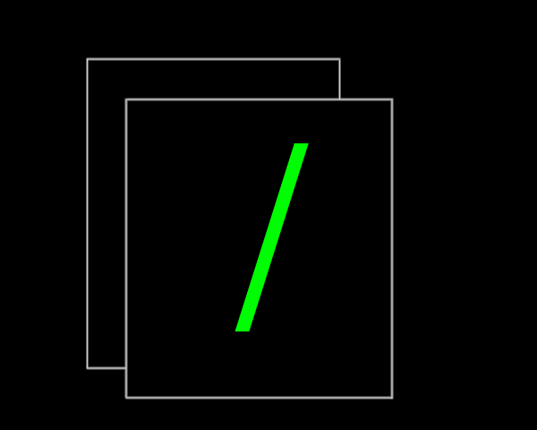

  
  
Slashcox - Discox, but support slashing commands

  

    
  

# Introduction
This project is basically [Discox](https://github.com/v1rbox/discox) but support slashing commands.

# Installation
The installation is pretty basic. If you are a discox developer (or contributor), you can (technically) immediately install it!

For the rest, read the [wiki](https://github.com/imindMan/slashcox/wiki)

# Documentation and Help
Always can be found on [wiki](https://github.com/imindMan/slashcox/wiki) page. You should read it.

# Contributing
You can always contribute to this project. I still need some better fixes for my ugly code and so much thing on. The repo always opens

# Contributors

Huge credit came from: discox btw
